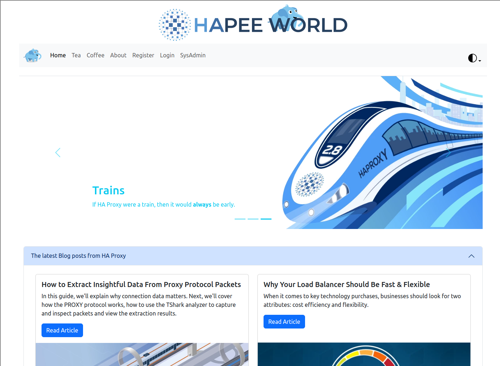

# HAPEE World Demo Site

This repository contains a set of containers and instructions for setting up a HAProxy demo environment.



## Containers

You will need to deploy atleast 2 containers for running the demo, a single web server, and a single api server with local databases. Alternatively you may deploy multiple web and api servers along with an external mongodb database. 

### frontend container

Build the container with:
```
cd frontend
docker build -t hapeeworld-fe:latest .
```

Run the container in development mode (make changes in real time)
```
docker run --rm -ti --entrypoint /bin/bash -v ~/hapee-webapp/frontend/app/:/usr/app --env NODE_ENV=development hapeeworld-fe:latest
```
Inside the container execute `/usr/app/run.sh` to start the node app

To run the container in production mode, simply execute 
```
docker run --rm -d hapeeworld-fe:latest
```

### middleware (api) container

Build the container with:
```
cd middleware
docker build -t hapeeworld-mw:latest .
```

Run the container in development mode (make changes in real time)
```
docker run --rm -ti --entrypoint /bin/bash -v ~/hapee-webapp/middleware/app/:/usr/app --env NODE_ENV=development hapeeworld-mw:latest
```
Inside the container execute `/usr/app/run.sh` to start the node app

To run the container in production mode, simply execute 
```
docker run --rm -d hapeeworld-mw:latest
```

### Optional database for multiple containers

If you want to deploy more than one frontend, then you should deploy an external mongo database somewhere and provide a connection URL to the frontend containers by setting a DATABASE environment variable. Eg:
```
docker run --rm -d --env DATABASE=mongodb://192.168.1.100:27017/blog hapeeworld-fe:latest
```

